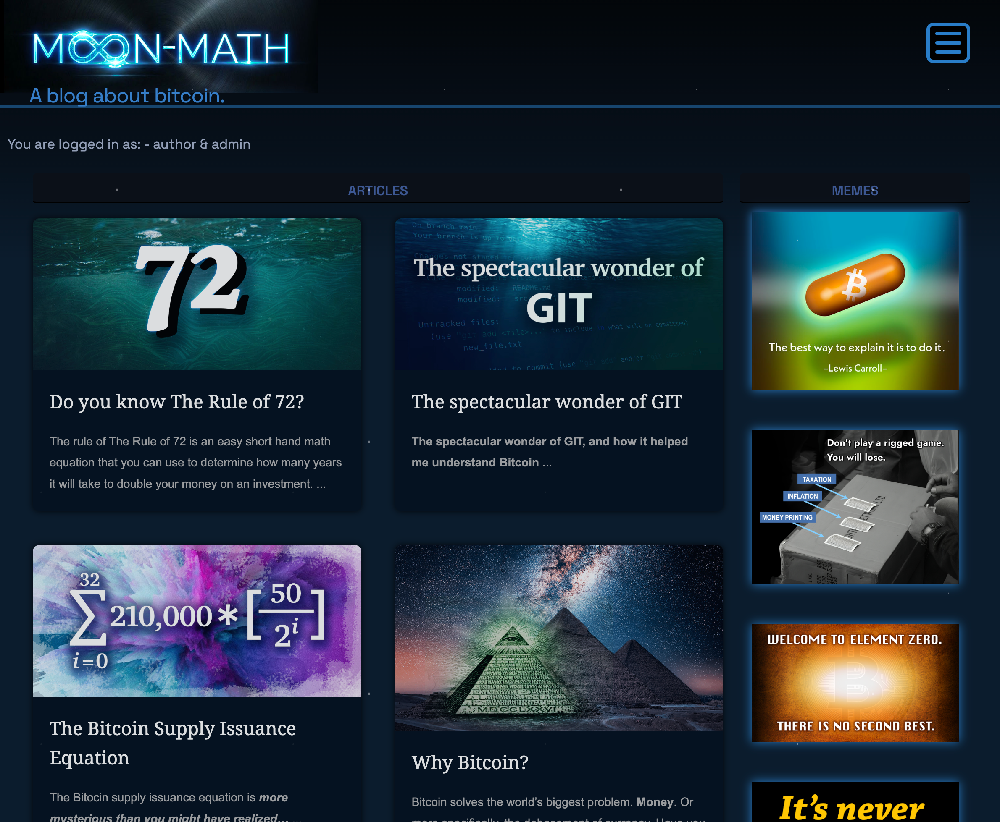

# Moon-Math.online

A Bitcoin blog and content platform built with **Next.js 15** (App Router), **TypeScript**, and **MongoDB**. Features article publishing with server-side SEO metadata, a memes gallery, a merch store, user authentication, and an admin panel.



---

## Table of Contents

1. [Tech Stack](#tech-stack)
2. [Project Structure](#project-structure)
3. [Prerequisites](#prerequisites)
4. [Installation](#installation)
5. [Development](#development)
6. [Production Build & Run](#production-build--run)
7. [Environment Variables](#environment-variables)
8. [API Routes](#api-routes)
9. [Notes](#notes)

---

## Tech Stack

| Layer | Technology | Purpose |
|-------|-----------|---------|
| **Framework** | [Next.js 15](https://nextjs.org) (App Router) | SSG, SSR, API routes, file-based routing |
| **UI Library** | [React 18](https://react.dev) | Component model, hooks |
| **Language** | [TypeScript](https://www.typescriptlang.org) | Type safety across the full stack |
| **Runtime** | [Node.js](https://nodejs.org) | Server runtime (via Next.js) |
| **Database** | [MongoDB](https://www.mongodb.com) | Document store for articles, products, users |
| **ODM** | [Mongoose](https://mongoosejs.com) | MongoDB schema definitions and queries |
| **Styling** | [Sass / SCSS](https://sass-lang.com) | Modular stylesheets with partials and variables |
| **State Management** | [Zustand](https://zustand-demo.pmnd.rs) | Lightweight global client state |
| **HTTP Client** | [Axios](https://axios-http.com) | API calls from client components |
| **Authentication** | [jsonwebtoken](https://github.com/auth0/node-jsonwebtoken) + [bcrypt](https://github.com/kelektiv/node.bcrypt.js) | JWT signing, password hashing |
| **JWT Decoding** | [jwt-decode](https://github.com/auth0/jwt-decode) | Parse JWT on the client without verification |
| **Email** | [Resend](https://resend.com) | Transactional email for contact form |
| **HTML Rendering** | [html-react-parser](https://github.com/remarkablemark/html-react-parser) | Render article body HTML as React elements |
| **Hosting** | AWS EC2 + PM2 | Self-hosted, filesystem-persistent |

---

## Project Structure

```
MyBlog/
├─ src/
│  ├─ app/                    # Next.js App Router pages + API routes
│  │  ├─ layout.tsx           # Root layout (title template, global styles)
│  │  ├─ page.tsx             # Homepage
│  │  ├─ about/page.tsx
│  │  ├─ resources/page.tsx
│  │  ├─ login/page.tsx
│  │  ├─ newUser/page.tsx
│  │  ├─ admin/page.tsx
│  │  ├─ memes/page.tsx
│  │  ├─ cart/page.tsx
│  │  ├─ check-out/page.tsx
│  │  ├─ user/page.tsx
│  │  ├─ article/
│  │  │  ├─ [id]/page.tsx     # SSG + generateMetadata (SEO)
│  │  │  ├─ new/page.tsx
│  │  │  └─ edit/[_id]/page.tsx
│  │  ├─ product/
│  │  │  ├─ [id]/page.tsx     # SSG + generateMetadata (SEO)
│  │  │  ├─ new/page.tsx
│  │  │  └─ edit/[_id]/page.tsx
│  │  └─ api/                 # Next.js Route Handlers (replaces Express)
│  │     ├─ articles/route.ts
│  │     ├─ articles/[id]/route.ts
│  │     ├─ products/route.ts
│  │     ├─ products/[id]/route.ts
│  │     ├─ users/route.ts
│  │     ├─ user/[id]/route.ts
│  │     ├─ login/route.ts
│  │     ├─ settings/route.ts
│  │     ├─ toggleMerch/route.ts
│  │     ├─ contact/route.ts
│  │     ├─ backup/route.ts
│  │     └─ wipe/route.ts
│  ├─ admin/                  # Admin panel components
│  ├─ components/             # Shared UI (banner-nav, footer, etc.)
│  ├─ data/useData.ts         # Data fetching hooks (axios)
│  ├─ hooks/
│  ├─ lib/mongodb.ts          # MongoDB singleton connection
│  ├─ models/                 # Mongoose models
│  │  ├─ Articles.ts
│  │  ├─ Products.ts
│  │  ├─ Users.ts
│  │  └─ Settings.ts
│  ├─ services/email.ts       # Resend email integration
│  ├─ state/useStore.ts       # Zustand global state
│  ├─ styles/                 # SCSS partials
│  ├─ utils/articleUtils.ts
│  └─ views/                  # Page component files
│     ├─ Articles/
│     ├─ Products/
│     ├─ About.tsx
│     ├─ Resources.tsx
│     ├─ Login.tsx
│     ├─ CreateAccount.tsx
│     ├─ EditUserPage.tsx
│     ├─ AdminPage.tsx
│     └─ MemesPage.tsx
├─ public/
│  ├─ uploads/                # User-uploaded images (served at /uploads/...)
│  │  ├─ articles/
│  │  └─ products/
│  └─ favicon.ico (+ other sizes)
├─ docs/
│  └─ screenshot.png
├─ .env
├─ next.config.ts
├─ package.json
└─ tsconfig.json
```

---

## Prerequisites

- Node.js >= 18.x
- npm >= 9.x
- MongoDB (local or Atlas)

---

## Installation

```bash
git clone <repo-url>
cd MyBlog
npm install
```

---

## Development

```bash
npm run dev
# → http://localhost:3000
```

---

## Production Build & Run

```bash
npm run build
npm run start
```

On EC2 with PM2:

```bash
npm run build
pm2 start "npm run start" --name moon-math
```

---

## Environment Variables

Create a `.env` file at the project root:

```
MONGO_URI=<your MongoDB connection string>
JWT_SECRET=<your JWT secret>
JWT_EXPIRES_IN=2h
RESEND_API_KEY=<your Resend API key>
MONGO_DUMP_PATH=<path to directory containing mongodump binary>
NODE_ENV=production
```

---

## API Routes

| Method | Endpoint | Description |
|--------|----------|-------------|
| `GET` | `/api/articles` | Fetch all articles |
| `POST` | `/api/articles` | Create article (multipart, with image) |
| `PATCH` | `/api/articles/:id` | Update article |
| `DELETE` | `/api/articles/:id` | Delete article |
| `GET` | `/api/products` | Fetch all products |
| `POST` | `/api/products` | Create product (multipart, with images) |
| `PATCH` | `/api/products/:id` | Update product |
| `DELETE` | `/api/products/:id` | Delete product |
| `GET` | `/api/users` | Fetch all users |
| `POST` | `/api/users` | Create user |
| `PATCH` | `/api/user/:id` | Update user |
| `POST` | `/api/login` | Login — returns JWT |
| `GET` | `/api/settings` | Fetch app settings |
| `POST` | `/api/toggleMerch` | Toggle merch/memes display on homepage |
| `POST` | `/api/contact` | Submit contact form (sends email via Resend) |
| `POST` | `/api/backup` | Trigger MongoDB backup (admin only) |
| `POST` | `/api/wipe` | Drop database (admin only) |

Uploaded files are served as static assets from `public/uploads/` at `/uploads/...`.

---

## Notes

- Keep `node_modules`, `.env`, and `.next/` out of Git
- Article and product pages use **SSG + ISR** (regenerated every hour) with server-side `generateMetadata()` for SEO — proper `<title>`, description, and Open Graph tags are in the HTML before JavaScript runs
- JWT auth is used for protected admin/author actions; tokens stored in `localStorage`
- The homepage toggles between a memes gallery and a merch store based on the `showMerch` setting in the database
- `src/views/` is used for page component files — Next.js reserves `src/pages/` for the Pages Router so that name is avoided
